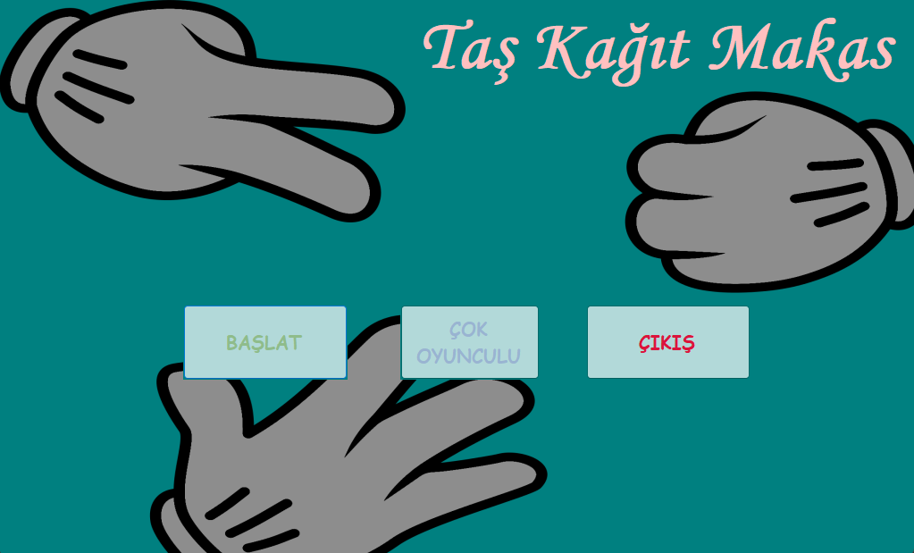
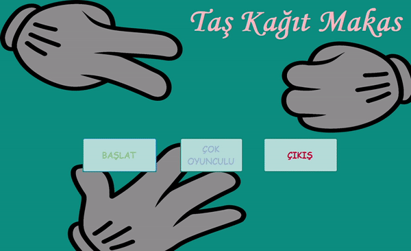

# TasKagitMakas - C# Windows App Uygulaması

## Herkese Selamlar

Bu proje, C#'a başladığım zaman yapmış olduğum ilk projelerden birisi. 
Bu projeyi yapmamdaki amaç; C# dilini öğrenmeye yeni başlamış birisi olarak, 'Windows App' uygulaması yaparken nelerle karşılaşabileceğimi kolay bir uygulama ile görmekti.

Farklı paneller arası geçiş yaparak, bilgisayara karşı veya yanımdaki bir arkadaşımla birlikte oynayabileceğim bir oyun tasarlamak istemiştim. Sonucunda böyle bir uygulama ortaya çıktı.

## İçindekiler

0. [Herkese Selamlar](#herkese-selamlar)
1. [Uygulama Hakkında](#uygulama-hakkında)
2. [Youtube Linki](#youtube-linki)

## Uygulama Hakkında

Uygulamanın anasayfasında 3 adet buton bulunmakta. Bu butonlardan soldaki, bilgisayara karşı taş-kağıt-makas oynamak için gerekli olan paneli açıyor. Ortadaki buton, aynı bilgisayardan birisiyle birlikte taş-kağıt-makas oynamak için gerekli olan paneli açıyor. Sağdaki buton ise uygulamayı kapatıyor.

Bilgisayara karşı ve oyuncuya karşı oynarken taraflardan birinin puanı 10 olursa o taraf kazanır.

### Sol Buton

### Orta Buton

## Youtube Linki

Youtube üzerinden paylaştığım uygulama videosuna [bu linkten](https://youtu.be/MhmEMIllaTQ) ulaşabilirsiniz.
